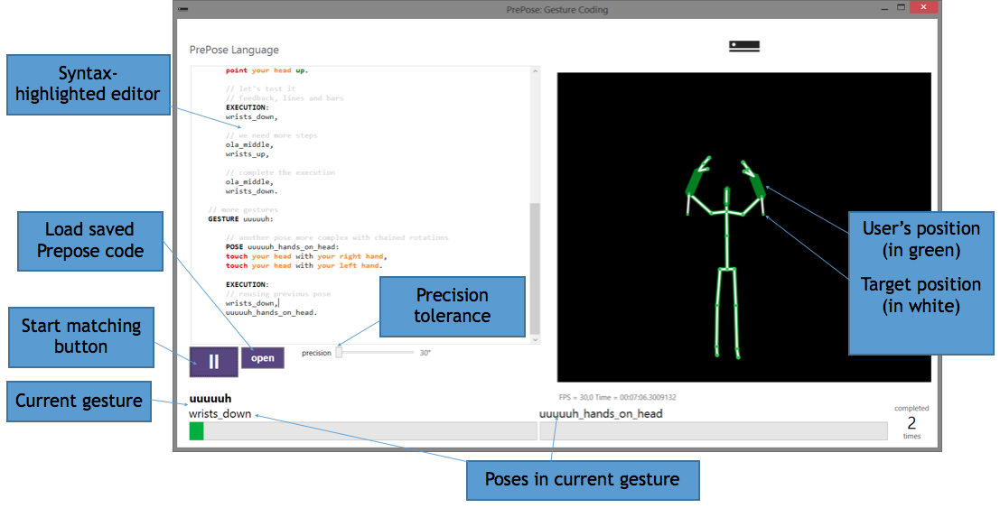

<!-- # Prepose
###A Scripting Language for Kinect v2 Gestures

With the rise of sensors such as the Microsoft Kinect, Leap Motion, and hand motion sensors in phones such as the Samsung Galaxy S5, natural user interface (NUI) has become practical. NUI raises two key challenges for the developer: first, developers must create new code to recognize new gestures, which is a time consuming process. Second, to recognize these gestures, applications must have access to depth and video of the user, raising privacy problems. We address both problems with Prepose, a novel domainspecific language (DSL) for easily building gesture recognizers, combined with a system architecture that protects user privacy against untrusted applications by running Prepose code in a trusted core, and only interacting with applications via gesture events.

Prepose lowers the cost of developing new gesture recognizers by exposing a range of primitives to developers that can capture many different gestures. Further, Prepose is designed to enable static analysis using SMT solvers, allowing the system to check security and privacy properties before running a gesture recognizer. We demonstrate that Prepose is expressive by creating novel gesture recognizers for 28 gestures in three representative domains: physical therapy, tai-chi, and ballet. We further show that matching user motions against Prepose gestures is efficient, by measuring on traces obtained from Microsoft Kinect runs.

Because of the privacy-sensitive nature of alwayson Kinect sensors, we have designed the Prepose language to be analyzable: we enable security and privacy assurance through precise static analysis. In Prepose, we employ a sound static analysis that uses an SMT solver (Z3), something that works well on Prepose but would be hardly possible for a general-purpose language. We demonstrate that static analysis of Prepose code is efficient, and investigate how analysis time scales with the complexity of gestures. Our Z3-based approach scales well in practice: safety checking is under 0.5 seconds per gesture; average validity checking time is only 188 ms; lastly, for 97% of the cases, the conflict detection time is below 5 seconds, with only one query taking longer than 15 seconds.


For more, please read this paper: http://research.microsoft.com/apps/pubs/default.aspx?id=232011 -->

# Prepose
> A scripting Language for Kinect v2 Gestures.


Prepose is a domain specific language for building custom gesture recognizers. Eventually, we will evolve Prepose into a "Scripting Language for NUI". We welcome feedback on how to improve Prepose!


## Running
1. Install the [Kinect for Windows SDK 2.0](https://www.microsoft.com/en-us/download/details.aspx?id=44561).
2. Open `Prepose.sln` with Visual Studio 2013.
3. Build and run `PreposeGestureRecognizer` by hitting `F5`.


## Wrting Prepose code



Above is a screen shot of the PreposeGestureRecognizer while running. On the left, a text editor window allows you to write code in the Prepose domain specific language with syntax highlighting and autocompletion. The highest level unit of Prepose is an “app.” Each app contains a set of “gestures,” which we will describe in more detail shortly.

When working with the PreposeGestureRecognizer, you write code for your gesture recognizer “app” in the text editor window. Then press the “start matching button” to parse your code and start interpreting the code. On the right, you will see a view of any Kinect skeletons detected by your Kinect v2 sensor. Before you start matching, the Kinect skeletons will be shown in green.

After you start matching, you will see the name of the current gesture at the bottom of the main window. You will also see a white skeleton that represents the “target” – that is, the place the tracked skeleton needs to be to match that part of the gesture. The thickness of skeleton limbs shows how close or how far away from the sensor the skeleton joint is. To match, a skeleton joint must be in the same location and the same depth as the target skeleton joint.

Each gesture consists of a sequence of “poses.” After matching starts, the bottom of the main window will show the names of each pose and a progress bar for each pose. The progress bar will fill up as the tracked skeleton comes close to matching a pose. After a pose is matched, Prepose will synthesize a new target skeleton using the Z3 constraint solver. After all poses are matched, the “recognized count” in the bottom right of the window increments. Then matching re-starts from the first pose in the gesture.

### Code example
Here’s an annotated example to show Prepose syntax and concepts.

```
// Declare a Prepose program named “soccer”
APP soccer:

	// We are building the “ola” or “wave” gesture
	// An app can have multiple gestures
	GESTURE ola:

		// A gesture is composed of poses
		// Poses specify a target skeleton position
		POSE wrists_down:

  		// use the “point” verb on body parts
  		// Down means orient the joint below the origin point at the hips
  		point your left wrist down,
  		point your right wrist down,

  		// pointing down is not natural, rotation needed
  		rotate your left wrist 30 degrees to your front,
  		rotate your right wrist 30 degrees to your front,
      point your head up,
    	rotate your head 20 degrees to your front.


		// We need more than one pose declared, so let’s create the next pose
		// NOTE: poses can be declared in any order, not necessarily the order
		// the user performs them to do the gesture.
		// We will specify the order of poses in the EXECUTION: section below.
		POSE ola_middle:

  		// Prepose supports groups of body parts
  		// “your wrists” is the same as “your left wrist” and “your right wrist”
  		point your wrists to your front.


		// We need more than one pose, so let’s create another one
		POSE wrists_up:
  		//put your hands above your head.
  		point your wrists up,
  		point your head up.


		// Execution gives us a sequence of poses to match in sequence
		// Commas separate each pose in the sequence
		// We can re-use any pose declared in the app
		// that includes poses not declared in this gesture (not shown)
		EXECUTION:
  		wrists_down,
  		// we need more steps
  		ola_middle,
  		wrists_up,
  		// complete the execution
  		ola_middle,
      wrists_down.
```

### Order of gesture matching
When you press the **start matching** button, `PreposeGestureRecognizer` will start running the last gesture defined in the text editor window, i.e. the one nearest the end of the text. This means if you want to try out a gesture that isn’t the last one in the text, you need to comment out or remove gestures following the last gesture.

### Loading text files
You can load text files containing Prepose code into the text editor. To do this, press the button marked **open**. You can then navigate your file system to find text files.

This repository includes several Prepose example files, including gestures from ballet, therapy, tai chi and others on the `Samples/` folder.
